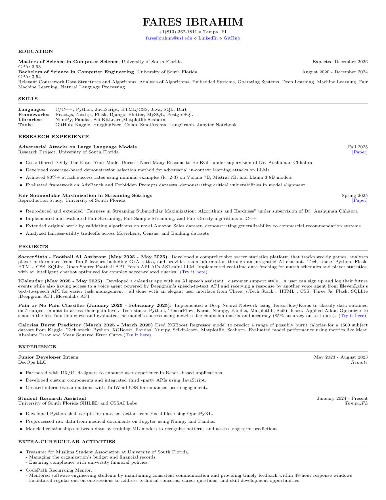

  

<!-- Profile README refreshed on 2026-06-26. -->

  
  
  
  

  

## Hey, I'm Fares

I'm a Computer Science MS student at the University of South Florida, a research assistant at CSSAI/SHIELD labs, and a developer focused on AI systems, machine learning, full-stack tools, and useful agents.

Right now I am especially interested in:

- adversarial attacks and safety evaluation for large language models
- fair machine learning and streaming submodular optimization
- applied AI products with clean user experiences
- Python, Flask, React, Next.js, LangGraph, Hugging Face, and data-heavy workflows

## Featured Work

<table>
  <tr>
    <td width="50%">
      <h3>SoccerStats</h3>
      
AI football assistant for weekly games, player performance, team data, and natural-language soccer questions.

      
<strong>Stack:</strong> Python, Flask, SQLite, HTML, CSS, Open Source Football API, Fetch.ai AS1-mini

      <a href="https://github.com/FaresIbrahim32/FecthAI-Flask">Repository</a>
    </td>
    <td width="50%">
      <h3>Fair ML Research</h3>
      
Reproduced and extended fair streaming submodular maximization algorithms across recommendation-style datasets.

      
<strong>Stack:</strong> C++, Python, fairness evaluation, algorithm analysis

      <a href="https://github.com/FaresIbrahim32/Fair_ML">Repository</a>
    </td>
  </tr>
  <tr>
    <td width="50%">
      <h3>Calories Burnt Predictor</h3>
      
XGBoost regression project for predicting estimated calories burned from Kaggle fitness data.

      
<strong>Stack:</strong> Python, XGBoost, Pandas, NumPy, Scikit-learn, Matplotlib, Seaborn

      <a href="https://github.com/FaresIbrahim32/Calories_burnt-predictor">Repository</a>
    </td>
    <td width="50%">
      <h3>Portfolio</h3>
      
Personal portfolio for projects, research, and developer work.

      
<strong>Stack:</strong> Modern web stack, deployment on Vercel

      <a href="https://github.com/FaresIbrahim32/Portfolio">Repository</a> | <a href="https://portfolio-phi-murex-dj4h643m5r.vercel.app">Live Site</a>
    </td>
  </tr>
</table>

## Research

**Adversarial Attacks on Large Language Models**  
Co-authored research on coverage-based demonstration selection for adversarial in-context learning attacks, reaching strong attack success rates with small example sets across Vicuna 7B, Mistral 7B, and Llama 3 8B.

**Fair Submodular Maximization in Streaming Settings**  
Reproduced and extended fair streaming algorithms, validating fairness-utility tradeoffs across MovieLens, Census, Banking, and Amazon Sales-style datasets.

## Tech Stack

  

  
  
  
  
  
  

## Resume

  

  <a href="./assets/FaresIbrahim-dev.pdf"><strong>Download the PDF resume</strong></a>

## GitHub Snapshot

  
  

  

